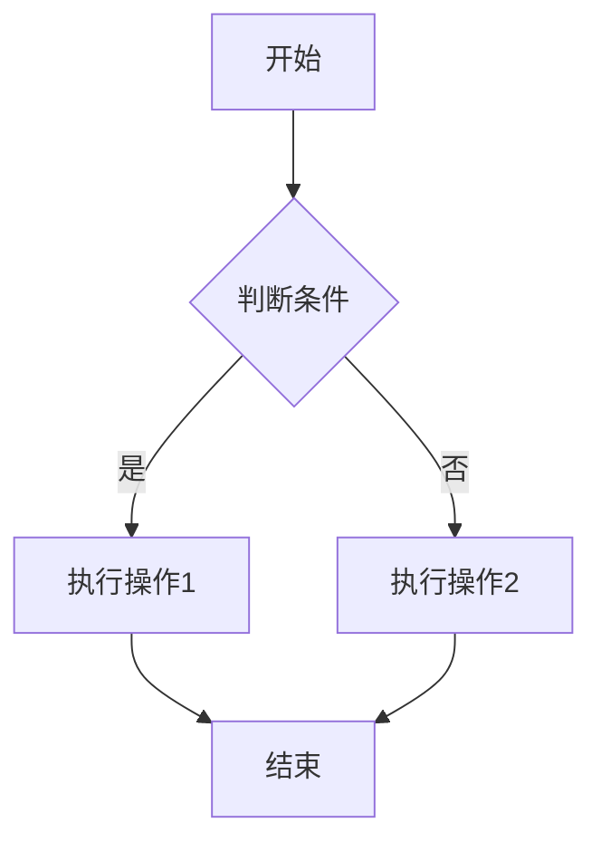

> **摘要：** 画流程图的方法按"图简单+只是给别人看" → Windows 画图/PPT 最快（手搓）；按"需要专业感+多次修改" → Draw.io / Xmind / Mermaid；按"AI 时代极简需求" → Mermaid 代码生成 / AI 对话生成。复杂度与修改频率是选工具的两个核心维度。

## 我的理解
> 由小林生成，供小涵审阅修改

流程图的核心痛点不在"画"，而在"修改"——画一次容易，反复改是地狱。所以工具选择不应该按"一次画得多漂亮"决定，而应该按"改一次要多久"决定。**Mermaid 类的文本驱动工具在修改频率高时**有压倒性优势（改文本即可，渲染自动），但学习曲线略陡。

**AI 时代的新增能力**：
- **AI 对话生成**：直接告诉 AI 你想画什么，让它生成 Mermaid/PlantUML 代码 → 渲染。这是最快路径（30 秒），但精度依赖描述
- **截图反推**：用 OCR 识别现有图像反推 Mermaid 代码 → 修改更精确
- **多人协作**：GitHub/GitLab 直接渲染 Mermaid，文档自带图，无需单独工具

**与 `harness-engineering` 的视角**：流程图也是 Harness 的一部分——一个 Agent 工作流图本质就是一个边界明确的工程定义。AI 写 Mermaid 代码 ≈ 写 DSL ≈ 描述协议，与 Harness Engineering 的"协议化"理念一致。

## 📌 关键要点

### 工具选型矩阵（按复杂度 × 修改频率）
| 场景 | 推荐工具 | 原因 |
|------|---------|------|
| 单次+简单（10 节点内） | Windows 画图 / macOS Preview | 0 学习成本，最快 |
| 单次+多元素 | PPT / Keynote | 模板丰富，对齐容易 |
| 反复修改+需要专业 | Draw.io / Xmind / ProcessOn | 拖拽 + 富文本模式 |
| 反复修改+文本驱动 | Mermaid / PlantUML | 改文本即可，版本控制友好 |
| AI 极简 | AI 生成 Mermaid 代码 + 在线渲染 | 30 秒出图 |
| 多人协作+文档内置 | GitHub/GitLab Markdown Mermaid | 文档自带图，无需工具 |

### AI 时代的新工作流
```
1. 自然语言描述流程 → AI 生成 Mermaid 代码 → 渲染
2. 截图识别 → AI 反推 Mermaid 代码 → 修改渲染
3. 已有 Mermaid 代码 → AI 解读/优化 → 重新生成
```

### Mermaid 入门语法

- TD/LR：方向（Top-Down / Left-Right）
- []：矩形节点
- {}：菱形判断
- ()：圆角矩形
- -->|标签|：带标签箭头

## 适用场景
- 程序员做架构图、流程图、时序图（强烈推荐 Mermaid）
- 产品经理做用户旅程图、业务流程
- 学生做课程作业、读书笔记
- 运营写 SOP、决策树
- GitHub README 写作（直接 Mermaid 渲染）

## 边界与注意
- **专业设计需求用专业工具**：海报级、HUD 界面、营销图等用 Sketch/Figma
- **Mermaid 复杂图（50+ 节点）渲染可能慢**：拆分子图或换 d2
- **Draw.io 截图时栅格化 vs 矢量化**：导出 SVG 才能无损缩放
- **AI 生成的代码不一定一次完美**：经常需要手动微调 1-2 次

## 原文摘要（来自小黑盒 老提问解答）

> 以前一个复杂任务扔给 Sol。找代码、翻文件、看日志、跑测试，最后还要自己作判断。什么都让它干。项目一大，主线工程很快就被各种中间结果塞满。...最适合的当然是用 Windows 画图或者 PPT 手搓了，别笑，如果图很简单的话这个真的最快的。在 AI 时代之前，比较常见的方案是用 Draw.io。

## 相关笔记
- `harness-engineering` — 流程图本身就是 Harness 的图形化定义
- `工具推荐与开源` — 同类工具收纳
- `Markdown-pipeline` — Mermaid 在文档中的应用
